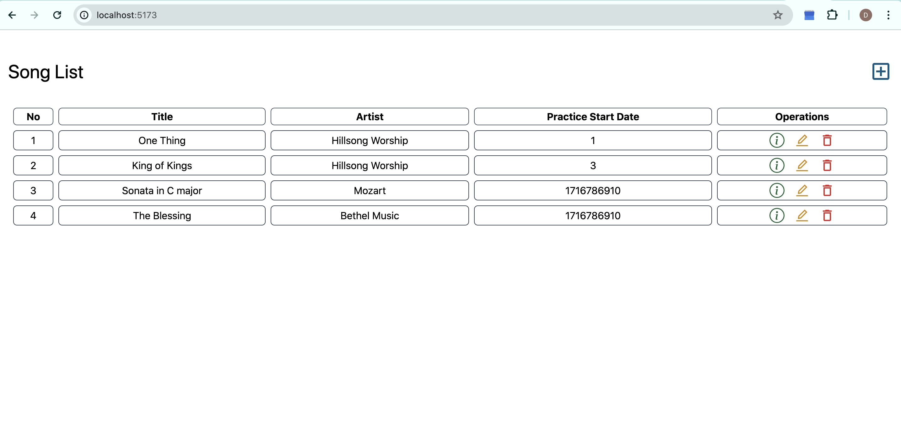
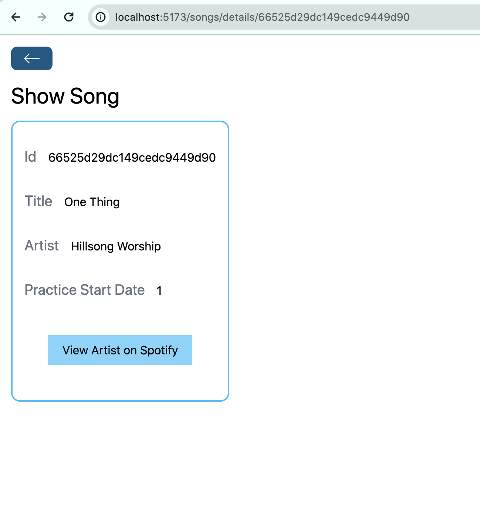
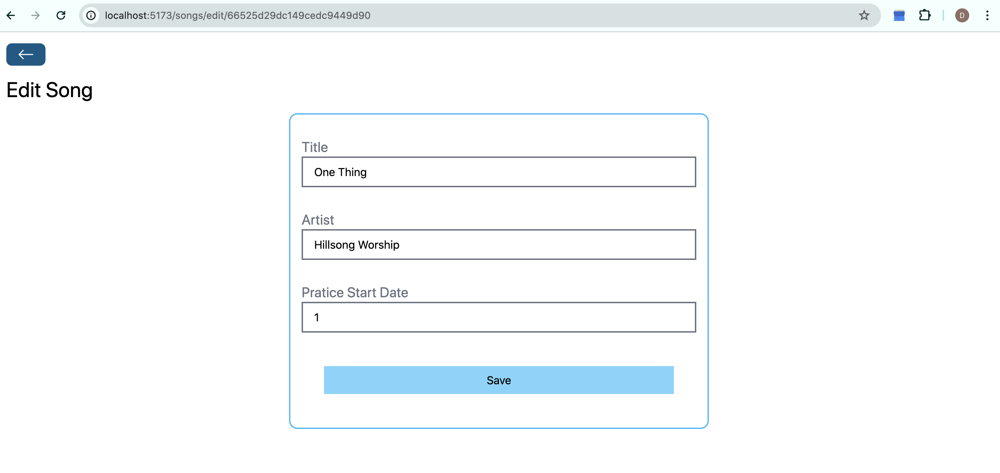

<!-- ABOUT THE PROJECT -->
## Table of contents

* [About This Project](#about-this-project)
    * [Built With](#built-with)
* [Running Script Locally](#running-script-locally)
* [Usage](#usage) 
* [Roadmap](#roadmap)
* [Ackowledgements](#acknowledgments)


## About This Project
As a pianist for a worship band, I often need to manage numerous songs that I'm practicing. To streamline this process, I decided to create a MERN (MongoDB, Express, React, Node) app to solve this problem. 

The homepage displays the songs I am currently practicing and provides options to delete, edit, and view details of each song. These functionalities are powered by REST APIs built with Express on the backend, with data stored in MongoDB. The implementation of the APIs can be found in `/backend/routes/songsRoute.js`
The app integrates with the Spotify public API to provide users with the option to redirect to the artist's page on Spotify when inspecting a song. The integration of this public API can be found in `/frontend/src/pages/ShowSong.jsx`


User can edit a song once it is saved.



## Running API locally
1) download the `Song_Pratice_Tracker` project.
2) 
```
$ cd backend
$ npm run dev
```
3) The API server will be running on [http://localhost:5555/](http://localhost:5555/). 
4) To get all the songs, send a `GET` request to [http://localhost:5555/songs](http://localhost:5555/songs)
5) To add a song, send a `POST` request to [http://localhost:5555/songs](http://localhost:5555/songs) with a body like:
```
{
    "title":"",
    "artist":"",
    "startDate": 0
}
```
3) To edit a song, send a `PUT` request to [http://localhost:5555/songs/id](http://localhost:5555/songs/id) with same body as above.


## Running the Web app
1) first make sure the backend server is running
2) Get a Spotify Api `CLIENT_ID` and `CLIENT_SECRET` and set the fields in `/frontend/src/pages/ShowSong.jsx`
3) 
```
$ cd frontend
$ npm run dev
```
4) the frontend is run on [http://localhost:5173/](http://localhost:5173/)
5) now you can interact with the web app


<!-- ROADMAP -->
## Future Improvements
Some functionality of this project is yet to be implemented/improved, inclduing:
- [ ] UI interface to add a song
- [ ] UI interface for song deletion
- [ ] Store Spotify API `CLIENT_SECRET` and `CLIENT_ID` in a .env file for security
- [ ] Utilize more of Spotify API functionality
- [ ] UI improvement.

<!-- ACKNOWLEDGMENTS -->
## Acknowledgments

These are some resources I would like to give credit to:
* [Building a Spotify API Searcher in React](https://www.youtube.com/watch?v=1PWDxgqLmDA)
* [MERN Stack Tutorial - Book Store Project](https://www.youtube.com/watch?v=-42K44A1oMA)